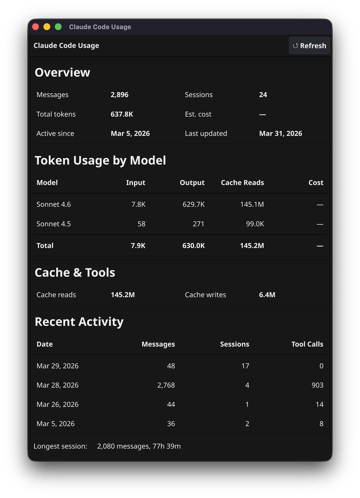

# Claude Code Usage

A lightweight cross-platform desktop app that displays your [Claude Code](https://claude.ai/code) usage statistics — the same data shown in the Claude Code usage settings.



## What it shows

- **Overview** — total messages, sessions, active-since date, last cache update
- **Token Usage by Model** — input tokens, output tokens, cache reads, and estimated cost per model with a totals row
- **Cache & Tools** — cache read/write token counts and web search requests
- **Recent Activity** — last 10 days of messages, sessions, and tool calls
- **Longest session** — message count and duration

Data is read directly from `~/.claude/stats-cache.json` on your local machine. No API key required, no network calls.

## Requirements

- [Go 1.22+](https://go.dev/dl/)
- macOS, Linux, or Windows
- [Claude Code](https://claude.ai/code) installed and used at least once (to generate the stats cache)

### macOS additional dependencies

Fyne requires Xcode Command Line Tools:

```bash
xcode-select --install
```

### Linux additional dependencies

```bash
# Debian/Ubuntu
sudo apt-get install gcc libgl1-mesa-dev xorg-dev

# Fedora
sudo dnf install gcc mesa-libGL-devel libXcursor-devel libXrandr-devel libXinerama-devel libXi-devel
```

## Build and run

```bash
git clone https://github.com/jeffpatterson/claude-usage.git
cd claude-usage
go mod tidy
go build -o claude-usage .
./claude-usage
```

Or skip the build and run directly:

```bash
go run .
```

## How it works

Claude Code writes usage statistics to `~/.claude/stats-cache.json` after each session. This app reads that file and renders it in a native window. The window auto-refreshes every 60 seconds so it stays current as you work.

## License

MIT
